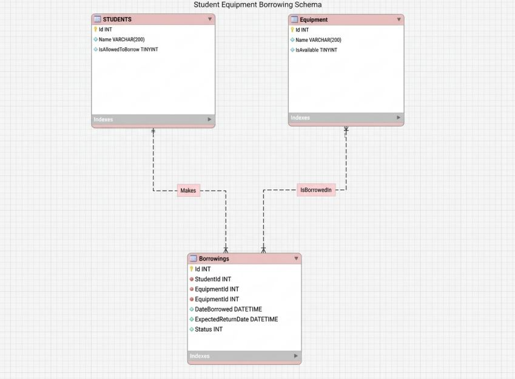

# Campus Equipment Borrowing System

## Part A: System Analysis

### Actors
- **Student**: Expects to borrow available equipment and have borrowing limits enforced.
- **Laboratory Administrator** (Implicit): Expects the system to track equipment status and student borrowing history.

### Use Cases

| Item | Description |
|------|-------------|
| **Use Case** | Borrow Equipment |
| **Primary Actor** | Student |
| **Preconditions** | Student is registered in the system; Equipment exists in the inventory |
| **Main Action** | Student requests to borrow available equipment; System validates student eligibility and equipment availability |
| **Expected Result** | Borrowing record created; Equipment marked as unavailable |
| **Possible Failure** | Student not allowed to borrow; Equipment does not exist; Equipment unavailable; Student reached maximum borrowing limit |

### Domain Concepts

**Student**
- Information: Id, Name, IsAllowedToBorrow
- Rules: Cannot borrow if not allowed
- Not Responsible For: Knowing which equipment is borrowed

**Equipment**
- Information: Id, Name, IsAvailable
- Rules: Can only be borrowed if available
- Not Responsible For: Tracking who borrowed it

**Borrowing**
- Information: Id, StudentId, EquipmentId, DateBorrowed, ExpectedReturnDate, Status
- Rules: Status changes from Active to Returned
- Not Responsible For: Validating student eligibility

---

## Part I: Architecture Explanation

### 1. Solution Structure

**EquipmentBorrowing.Domain**
- Contains core business entities (Student, Equipment, Borrowing, BorrowingStatus)
- Represents the problem domain without technical concerns
- Has NO dependencies on other projects

**EquipmentBorrowing.Application**
- Contains use case implementations (BorrowEquipmentService)
- Defines repository interfaces (IStudentRepository, IEquipmentRepository, IBorrowingRepository)
- Coordinates domain objects to accomplish business operations

**EquipmentBorrowing.Infrastructure**
- Contains technical implementations of repository interfaces
- Currently uses in-memory storage (C# Lists)
- Can be replaced with database implementations without changing other layers

**EquipmentBorrowing.Tests**
- Contains automated tests (structure created, tests can be added later)

**EquipmentBorrowing.Demo**
- Console application demonstrating the system works
- Manually wires up dependencies (Dependency Injection)

### 2. Dependency Direction
```
Demo / Future UI
      │
      ▼
 Application ──────► Domain
      ▲                  
      │                  
 Infrastructure ──────────┘
```

**Explanation:**
- Application layer depends on Domain (uses entities)
- Infrastructure layer depends on both Application (implements interfaces) and Domain (uses entities)
- Domain layer has NO dependencies (pure business logic)
- This follows the Dependency Inversion Principle

### 3. Use Case Mapping

**Use Case: Borrow Equipment**

- **Actor**: Student
- **Use Case**: Borrow Equipment
- **Application Service**: BorrowEquipmentService
- **Domain Objects Used**: Student, Equipment, Borrowing, BorrowingStatus
- **Repository Interfaces Used**: IStudentRepository, IEquipmentRepository, IBorrowingRepository
- **Infrastructure Implementations Used**: InMemoryStudentRepository, InMemoryEquipmentRepository, InMemoryBorrowingRepository

### 4. Reflection

**1. Why should the application service depend on a repository interface instead of directly depending on a database implementation?**

The application service should depend on interfaces to achieve **separation of concerns** and follow the **Dependency Inversion Principle**. This makes the code:
- **Testable**: We can use in-memory repositories for testing without a database
- **Flexible**: We can swap implementations (SQLite, PostgreSQL, API) without changing business logic
- **Maintainable**: Changes to data storage don't affect business rules

**2. Which parts of your current solution could remain unchanged if SQLite were added later?**

- **Domain layer**: All entities (Student, Equipment, Borrowing) would remain exactly the same
- **Application layer**: BorrowEquipmentService and repository interfaces would NOT change
- Only the **Infrastructure layer** would change (we'd add SqliteRepository implementations)

**3. Which project would eventually contain Avalonia Views?**

A new project (e.g., `EquipmentBorrowing.UI` or `EquipmentBorrowing.Desktop`) would contain Avalonia Views. This project would depend on the Application layer to call use cases.

**4. Should an Avalonia button directly execute database queries? Why or why not?**

**NO.** An Avalonia button should NOT directly execute database queries because:
- It violates **separation of concerns** (UI mixing with data access)
- It makes the code **untestable** (UI code is hard to test automatically)
- It creates **tight coupling** (changing database changes the UI)
- The button should call the **Application Service** (BorrowEquipmentService), which coordinates the operation

**5. What part of your implementation represents the actual business operation requested by the actor?**

The **BorrowEquipmentService.ExecuteAsync()** method in the Application layer represents the actual business operation. It:
- Validates all business rules (student allowed, equipment available, borrowing limits)
- Coordinates domain objects and repositories
- Creates the borrowing record when all conditions are met
- Returns clear success/failure messages

---

---

## Laboratory Activity 2: Avalonia UI and MVVM

### 1. Desktop Project

`EquipmentBorrowing.Desktop` is the part of the app that the user actually sees and clicks on. Its job is to:
- Show the list of equipment and active borrowings
- Let the user pick a student, equipment, and return date
- Remember what the user has selected and which page they're on
- Call the existing services (`BorrowEquipmentService`, `ReturnEquipmentService`) when the user clicks a button
- Show a message telling the user if something worked or failed

It uses `EquipmentBorrowing.Application` (to call the services) and `EquipmentBorrowing.Infrastructure` (to get the actual data). It does not contain any of the borrowing rules itself — those all still live in the Domain and Application layers from Lab 1. The Desktop project just shows things and passes user actions along.

### 2. Updated Architecture

```
Avalonia View (MainWindow, EquipmentView, BorrowingsView)
        |
        | Binding / Command
        v
ViewModel (MainViewModel, EquipmentViewModel, BorrowingsViewModel)
        |
        | Application Operation
        v
Application Service (BorrowEquipmentService, ReturnEquipmentService)
        |
        +----------> Domain (Student, Equipment, Borrowing)
        |
        v
Repository Interface (IStudentRepository, IEquipmentRepository, IBorrowingRepository)
        ^
        |
Infrastructure Implementation (InMemoryStudentRepository, InMemoryEquipmentRepository, InMemoryBorrowingRepository)
```

The Domain and Application layers from Lab 1 didn't really change. We just added the Desktop project on top of them.

### 3. Borrow Equipment Flow

1. The user picks a student, picks equipment, and picks a return date in `EquipmentView`.
2. The user clicks **Borrow Equipment**, which runs `EquipmentViewModel.BorrowAsync()`.
3. `BorrowAsync()` only checks simple things first — did the user actually pick a student, pick equipment, and pick a real date.
4. If that's fine, it calls `_borrowEquipmentService.ExecuteAsync(studentId, equipmentId, expectedReturnDate)`.
5. `BorrowEquipmentService` (the same one from Lab 1) checks the real rules: does the student exist, are they allowed to borrow, does the equipment exist, is it available, is the date okay, and has the student already borrowed too many things.
6. If everything checks out, it creates the borrowing, marks the equipment as borrowed, and sends back a success message.
7. That message shows up on screen in `StatusMessage`.
8. The equipment list refreshes so the user sees the updated availability right away.

### 4. Return Equipment Flow

1. The user goes to `BorrowingsView` and clicks on a borrowing in the list.
2. The user clicks **Return Equipment**, which runs `BorrowingsViewModel.ReturnAsync()`.
3. `ReturnAsync()` just checks that something was actually selected.
4. It calls `_returnEquipmentService.ExecuteAsync(borrowingId)`.
5. `ReturnEquipmentService` finds the borrowing, checks it wasn't already returned, marks it as returned, and marks the equipment as available again.
6. The result message is shown to the user.
7. The list refreshes, so the returned item disappears, and the equipment shows as available again if you check the Equipment page.

### 5. Architectural Reflection

**1. Why should the View not call a repository directly?**
- The View is only supposed to show things and take input. If it talked to the repository directly, it could skip all the rules (like checking if a student is allowed to borrow), since repositories don't know about those rules — only the Application layer does.

**2. Why should business rules not be implemented in the ViewModel?**
- If we wrote the rules again inside the ViewModel, we'd have the same rule in two places. If we ever needed to change a rule, we'd have to remember to change it in both places, and it's easy to forget one. Keeping the rule in only one place (the Application layer) avoids that problem.

**3. What is the responsibility of the ViewModel?**
- The ViewModel keeps track of what's on screen — like the list of equipment, what's selected, and any messages to show. It also has the commands (like "Borrow" or "Return") that the buttons use. It checks simple stuff like "did the user pick something," but it doesn't decide if a borrow is actually allowed — it just asks the service.

**4. Why can the existing Application layer work without knowing that Avalonia is being used?**
- Because `BorrowEquipmentService` and `ReturnEquipmentService` only depend on the repository interfaces and the Domain classes — nothing about Avalonia. That means the same service code could be used by a totally different interface (like our console Demo app) without any changes.

**5. What advantage is gained from registering dependencies in one composition point?**
- Setting up everything in one place (`App.axaml.cs`) makes it easy to see how the whole app is wired together. If something needs to change — like using a different repository — we only need to update it in one spot, instead of hunting through the whole codebase.

**6. If the in-memory repository were replaced by SQLite later, which parts of the current interface should remain largely unchanged?**
- Everything except the Infrastructure layer would stay the same — the Domain classes, the Application services, and the whole Desktop project (Views and ViewModels) wouldn't need to change at all. We would only need to write new SQLite versions of the repositories and swap them in during setup.

## Laboratory Activity 3: Persistent Storage with SQLite and EF Core

### Part B: Database Design

The database uses exactly three tables, matching the three Domain entities
from Lab 1: `Students`, `Equipment`, and `Borrowings`.

**Students**
| Column | Type | Notes |
|---|---|---|
| Id | INTEGER | Primary key |
| Name | TEXT | Required, max length 200 |
| IsAllowedToBorrow | INTEGER | 0 or 1 |

**Equipment**
| Column | Type | Notes |
|---|---|---|
| Id | INTEGER | Primary key |
| Name | TEXT | Required, max length 200 |
| IsAvailable | INTEGER | 0 or 1 |

**Borrowings**
| Column | Type | Notes |
|---|---|---|
| Id | INTEGER | Primary key |
| StudentId | INTEGER | Foreign key → Students.Id |
| EquipmentId | INTEGER | Foreign key → Equipment.Id |
| DateBorrowed | TEXT (DateTime) | Required |
| ExpectedReturnDate | TEXT (DateTime) | Required |
| Status | INTEGER | 0 = Active, 1 = Returned |

**Relationships:** one Student has many Borrowings; one Equipment appears
in many Borrowings. Both foreign keys use `DeleteBehavior.Restrict`, so a
Student or Equipment row cannot be deleted while it still has related
Borrowings — this protects the borrowing history from being silently lost.



The diagram was made in a separate modeling tool and exported as an
image. It reflects the actual database exactly as EF Core created it —
column names, types, and the two foreign keys all match what `dotnet ef`
generated in the `InitialCreate` migration.

---

### Part C: Sample Database Queries

Five representative SQL queries are written directly against the schema
in `docs/database-queries.sql`, before any C# code touches the database:

1. Select all equipment.
2. Filter equipment to only available items.
3. Join active borrowings with the related student and equipment names.
4. Aggregate: count of active borrowings per student.
5. Update a single equipment row's availability.

Writing these first, in plain SQL, made it easier to design the LINQ
queries later in Part M — each of the three required LINQ queries has a
direct SQL counterpart in this file.

---

### Part D: Adding SQLite and EF Core

Two NuGet packages were added to the Infrastructure project:
`Microsoft.EntityFrameworkCore.Sqlite` and
`Microsoft.EntityFrameworkCore.Design` (version 10.0.12), along with the
`dotnet-ef` global tool at the same version, so the tool and the package
versions match.

A version conflict (NU1605) appeared because the Desktop project's
`Microsoft.Extensions.DependencyInjection` package was on a different
version than what EF Core 10.0.12 expected. Pinning Desktop's package to
the same 10.0.12 version resolved it. This is a normal part of adding EF
Core to a solution that already has its own dependency injection setup.

---

### Part E: AppDbContext

`Infrastructure/Data/AppDbContext.cs` defines the bridge between the
Domain entities and the database:

```csharp
public class AppDbContext : DbContext
{
    public DbSet<Student> Students => Set<Student>();
    public DbSet<Equipment> Equipment => Set<Equipment>();
    public DbSet<Borrowing> Borrowings => Set<Borrowing>();

    public AppDbContext(DbContextOptions<AppDbContext> options)
        : base(options) { }
}
```

It takes its configuration through the constructor (`DbContextOptions`)
rather than hardcoding a connection string, so the same class works both
for the running app (pointed at the real SQLite file) and for EF Core's
design-time tools (pointed at wherever `AppDbContextFactory` says).

---

### Part F: Entity Configuration

`OnModelCreating` in `AppDbContext` configures each entity with the
Fluent API:

- Every entity's `Id` is set as the primary key.
- `Name` on `Student` and `Equipment` is required, with a max length of
  200 characters.
- `Borrowing.Status` (a C# enum) is stored as a plain integer with
  `HasConversion<int>()`, so SQLite stores `0` for Active and `1` for
  Returned instead of a string.
- `Borrowing.StudentId` and `Borrowing.EquipmentId` are configured as
  foreign keys to `Students.Id` and `Equipment.Id`, both using
  `DeleteBehavior.Restrict` — a Student or Equipment row cannot be
  deleted while a Borrowing still references it.

No explicit unique constraints were added. `Student.Name` and
`Equipment.Name` are not required to be unique, since two students could
share a name, and two identical pieces of equipment (e.g. two of the same
model of laptop) would need separate rows with the same name in a real
deployment. EF Core does automatically create indexes on both foreign
keys (`IX_Borrowings_StudentId`, `IX_Borrowings_EquipmentId`), confirmed
in DB Browser for SQLite, which speeds up the joins used in Part M.

---

### Part G: Migration and Database Creation

The `InitialCreate` migration was generated and applied with `dotnet ef`:

dotnet ef migrations add InitialCreate --project src/EquipmentBorrowing.Infrastructure
dotnet ef database update --project src/EquipmentBorrowing.Infrastructure

The database file location is decided by
`AppDbContextFactory.GetDbPath()`, which returns:

%LOCALAPPDATA%\EquipmentBorrowing\equipmentborrowing.db


An absolute path under the user's LocalAppData folder was used instead of
a relative path, so the database always lands in a predictable, per-user
location no matter which folder the app is launched from — a relative
path had initially put the file inside the Infrastructure project folder
by accident, which is not appropriate for a real application's data.

`IDesignTimeDbContextFactory` is implemented so that `dotnet ef` commands
can construct an `AppDbContext` at design time (when creating a
migration), without needing the full dependency injection container that
the running app uses.

---

### Part H: EF Core Repositories

Three repository classes were added to
`Infrastructure/Repositories/`, each implementing the same interface as
its in-memory counterpart from Lab 1, but backed by `AppDbContext`
instead of a `List<T>`:

- `EfStudentRepository`
- `EfEquipmentRepository`
- `EfBorrowingRepository`

Each method either reads with `AsNoTracking()` for display-only data, or
keeps tracking on when the calling service is going to modify and save
the entity. See Part O for the full explanation of which is used where
and why.

The original in-memory repositories (`InMemoryStudentRepository`,
`InMemoryEquipmentRepository`, `InMemoryBorrowingRepository`) were kept
in the project rather than deleted. They still compile and satisfy the
same interfaces, so they remain available as a reference or for testing
without a real database, even though the app no longer uses them at
runtime.

---

### Part I: Confirming the Application Services

`BorrowEquipmentService` and `ReturnEquipmentService` needed **no
changes** to work with the new EF Core repositories. Both classes depend
only on `IStudentRepository`, `IEquipmentRepository`, and
`IBorrowingRepository` — never on `InMemory...` classes, `AppDbContext`,
or anything EF Core or SQLite specific.

This confirms the same point made in the Lab 1 and Lab 2 reflection
questions: because the services depend on interfaces, not on any specific
storage technology, swapping in-memory storage for a real database only
required writing new repository classes (Part H) and updating dependency
injection (Part J) — no business logic anywhere had to change.

---

### Part N: Inspecting Generated SQL

EF Core translates LINQ queries into SQL before sending them to SQLite.
Using LINQ does not eliminate SQL — EF Core still builds and executes real
SQL statements underneath. Below are three LINQ queries from the app, the
SQL EF Core generated for each, and what that SQL does.

#### Query 1: Retrieve all equipment (Equipment page)

**LINQ Query** (`EfEquipmentRepository.GetAllAsync`)
```csharp
return await _context.Equipment
    .AsNoTracking()
    .ToListAsync(cancellationToken);
```

**Generated SQL**
```sql
SELECT "e"."Id", "e"."IsAvailable", "e"."Name"
FROM "Equipment" AS "e"
```

**Explanation**
EF Core selects only the three columns the `Equipment` entity has, from
the `Equipment` table. No joins or filters are needed since every row is
returned. `AsNoTracking()` tells EF Core not to track these entities for
changes, since this list is only for display.

---

#### Query 2: Active borrowings with student and equipment names

**LINQ Query** (`EfBorrowingRepository.GetActiveBorrowingsAsync`)
```csharp
return await (
    from b in _context.Borrowings.AsNoTracking()
    join s in _context.Students.AsNoTracking() on b.StudentId equals s.Id
    join e in _context.Equipment.AsNoTracking() on b.EquipmentId equals e.Id
    where b.Status == BorrowingStatus.Active
    select new ActiveBorrowingDetails
    {
        BorrowingId = b.Id,
        StudentName = s.Name,
        EquipmentName = e.Name,
        DateBorrowed = b.DateBorrowed,
        ExpectedReturnDate = b.ExpectedReturnDate
    }
).ToListAsync(cancellationToken);
```

**Generated SQL**
```sql
SELECT "b"."Id" AS "BorrowingId", "s"."Name" AS "StudentName",
       "e"."Name" AS "EquipmentName", "b"."DateBorrowed",
       "b"."ExpectedReturnDate"
FROM "Borrowings" AS "b"
INNER JOIN "Students" AS "s" ON "b"."StudentId" = "s"."Id"
INNER JOIN "Equipment" AS "e" ON "b"."EquipmentId" = "e"."Id"
WHERE "b"."Status" = 0
```

**Explanation**
The LINQ `join` clauses become SQL `INNER JOIN`s. EF Core joins the
`Borrowings` table to `Students` and `Equipment` on their foreign keys, so
the query returns real names instead of raw IDs. The `where` clause
becomes `WHERE "b"."Status" = 0`, since `BorrowingStatus.Active` is stored
as the integer `0`. This fixed a UI bug where the Active Borrowings screen
showed "Student #1" instead of "Alice Santos".

---

#### Query 3: Count of active borrowings for a student

**LINQ Query** (`EfBorrowingRepository.GetActiveBorrowingsCountByStudentIdAsync`)
```csharp
return await _context.Borrowings
    .CountAsync(b => b.StudentId == studentId && b.Status == BorrowingStatus.Active, cancellationToken);
```

**Generated SQL**
```sql
SELECT COUNT(*)
FROM "Borrowings" AS "b"
WHERE "b"."StudentId" = @studentId AND "b"."Status" = 0
```

**Explanation**
`CountAsync` becomes SQL's `COUNT(*)`. Only a single number is returned,
not the actual rows, so the database does the counting instead of EF Core
loading every borrowing into memory. This query enforces the rule that a
student cannot have more than 3 active borrowings at once.

---

### Part O: Tracking and No-Tracking Queries

EF Core tracks entities by default so it can detect changes and save them
later. Tracking has a small memory and performance cost, so it should only
be used when an entity will actually be modified.

**Read-only queries use `AsNoTracking()`**

- `EfStudentRepository.GetByIdAsync` and `GetAllAsync` — students are only
  displayed (in the borrow dropdown), never changed.
- `EfEquipmentRepository.GetAllAsync` — the equipment list is only
  displayed.
- `EfBorrowingRepository.GetActiveBorrowingsAsync` — the active borrowings
  list is only displayed.

**Tracked queries (no `AsNoTracking()`)**

- `EfEquipmentRepository.GetByIdAsync` — used by `BorrowEquipmentService`
  and `ReturnEquipmentService`, which call `MarkAsBorrowed()` or
  `MarkAsReturned()` on the result and then save it. EF Core needs to
  track the entity to detect that change.
- `EfBorrowingRepository.GetByIdAsync` — used by `ReturnEquipmentService`,
  which calls `MarkAsReturned()` on the result and saves it.

**Why this matters**

If `AsNoTracking()` were used on `GetByIdAsync` for equipment or
borrowings, EF Core would not notice that `MarkAsBorrowed()` or
`MarkAsReturned()` changed the object, and `SaveChangesAsync()` would have
nothing to save. Tracking must stay on for any entity that will be
modified and saved. Conversely, using tracking on a display-only list
would waste memory tracking objects that are never going to change.

---

### Part P: Confirming UI and Database Separation

The application keeps a clear separation between the user interface and
the database, following the same layered architecture from Labs 1 and 2:

```
Avalonia View (EquipmentView, BorrowingsView)
↓ binding / command
ViewModel (EquipmentViewModel, BorrowingsViewModel)
↓ calls
Application Service (BorrowEquipmentService, ReturnEquipmentService)
↓ uses
Repository Interface (IStudentRepository, IEquipmentRepository, IBorrowingRepository)
↓ implemented by
Ef...Repository (EfStudentRepository, EfEquipmentRepository, EfBorrowingRepository)
↓ uses
AppDbContext → SQLite database
```

**What this means in practice**

- No `.axaml` view or ViewModel references `AppDbContext`, EF Core, or
  SQLite anywhere. They only know about `IStudentRepository`,
  `IEquipmentRepository`, and `IBorrowingRepository`.
- All SQL is generated inside the three `Ef...Repository` classes in the
  Infrastructure project. No SQL, LINQ-to-database queries, or EF Core
  types appear in Desktop, Application, or Domain.
- `BorrowEquipmentService` and `ReturnEquipmentService` are unchanged from
  Lab 1 and Lab 2. Switching from in-memory storage to SQLite in Lab 3
  only required writing new repository classes and updating the
  dependency injection setup in `App.axaml.cs` — no service, ViewModel,
  or View code needed to change.
- This confirms the same conclusion reached in the Lab 1 and Lab 2
  reflection questions: because every layer only depends on interfaces
  from the layer below it, the real database technology can change
  without forcing changes anywhere else in the application.